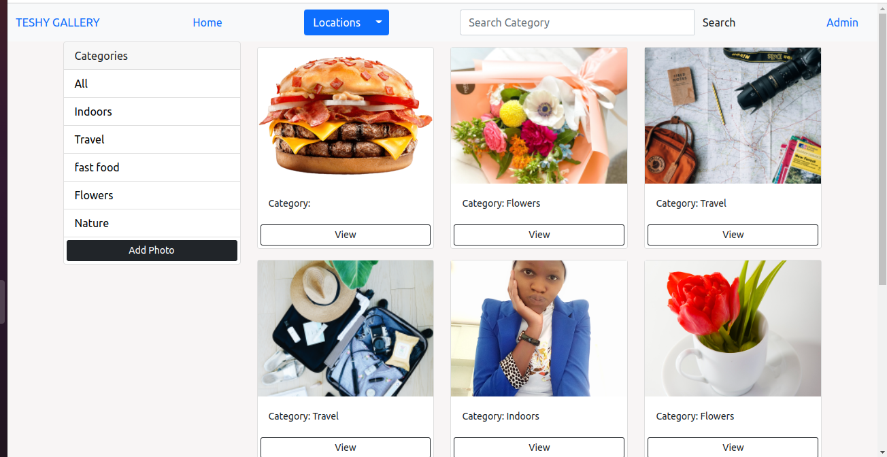
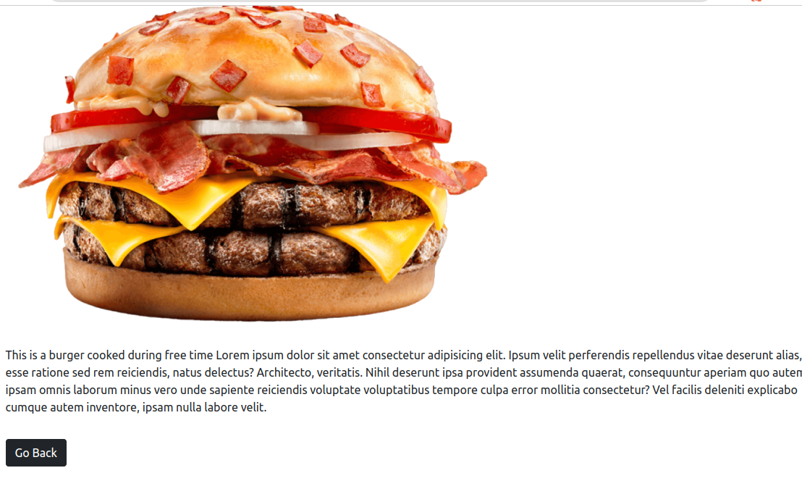
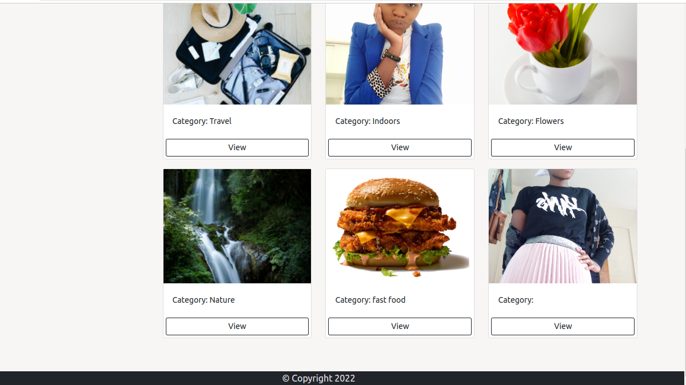

 # Personal-Gallery
#### By Teresiah Githua
### Screenshots
```
Landing Page
```
  
  
 

## Description
<p>A web application that displays a list of various images in their categories. On choosing a category, it will preview that category as modal.</p>

## Installation
### Requirements

* Either a computer,phone,tablet or an Ipad
* An access to the Internet

## To get the code..

1. Cloning the repository:
  ```bash
   git clone https://github.com/Teresiah-cpu/Tesh-gallery
  ```
2. Move to the folder and install requirements
  ```bash
  cd my_gallery
  pipenv install <package name>
  ```
3. Running the application

  ```bash
  make
  ```
4. Testing the application
  ```bash
  python3.8 manage.py test
  ```
Open the application on your browser `127.0.0.1:8000`.
## Livelink
You can view the site at:Heroku

## User Stories
These are the behaviours/features that the application implements for use by a user.

* View different photos that interest me.
* Click on a single photo to expand it and also view the details of the photo. The photo details must appear on a modal within the same route as the main page.
* Search for different categories of photos. (ie. Travel, Food)
* Copy a link to the photo to share with my friends.
* View photos based on the location they were taken.
### Technologies
* BackEnd:
      * Python
      * Django
* FontEnd:
      * HTML
      * CSS
      * JavaScript
      * Bootstrap
* Database
      * PostgreSQL
* Deployment
      * Heroku   
### BDD
| Input              | Output                     |
|---------------     |---------------             |
| Click on a photo   | Display images with details |
| Right click on a photo| Copy Link to Clipboard      |
| Search image in a certain category| View photos matching search term|

## Technologies Used
Python 3.9.10
Django 4.0.3
Pillow 9.0.1
## License
MIT License

Copyright (c) [2022] [Teresiah Githua]

Permission is hereby granted, free of charge, to any person obtaining a copy of this software and associated documentation files (the "Software"), to deal in the Software without restriction, including without limitation the rights to use, copy, modify, merge, publish, distribute, sublicense, and/or sell copies of the Software, and to permit persons to whom the Software is furnished to do so, subject to the following conditions:

The above copyright notice and this permission notice shall be included in all copies or substantial portions of the Software.

THE SOFTWARE IS PROVIDED "AS IS", WITHOUT WARRANTY OF ANY KIND, EXPRESS OR IMPLIED, INCLUDING BUT NOT LIMITED TO THE WARRANTIES OF MERCHANTABILITY, FITNESS FOR A PARTICULAR PURPOSE AND NONINFRINGEMENT. IN NO EVENT SHALL THE AUTHORS OR COPYRIGHT HOLDERS BE LIABLE FOR ANY CLAIM, DAMAGES OR OTHER LIABILITY, WHETHER IN AN ACTION OF CONTRACT, TORT OR OTHERWISE, ARISING FROM, OUT OF OR IN CONNECTION WITH THE SOFTWARE OR THE USE OR OTHER DEALINGS IN THE SOFTWARE.

## Authors Info
* Reach me via
* Email: terrywambo2018@gmail.com

## Development server

The application is deployed to heroku

# Go Back to the top -->


